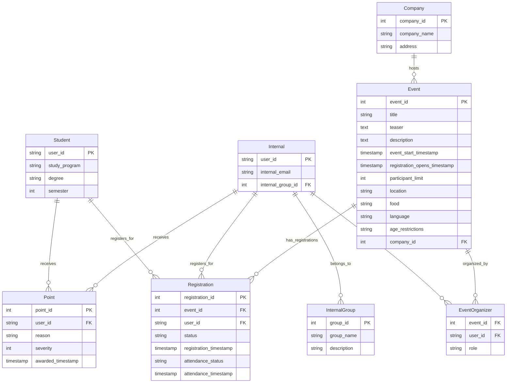

```mermaid
erDiagram
    Student {
        string user_id PK
        string study_program
        string degree
        int semester
    }

    Internal {
        string user_id PK
        string internal_email
        int internal_group_id FK
    }

    InternalGroup {
        int group_id PK
        string group_name
        string description
    }

    Company {
        int company_id PK
        string company_name
        string address
    }

    Event {
        int event_id PK
        string title
        text teaser
        text description
        timestamp event_start_timestamp
        timestamp registration_opens_timestamp
        int participant_limit
        string location
        string food
        string language
        string age_restrictions
        int company_id FK
    }

    EventOrganizer {
        int event_id FK
        string user_id FK
        string role
    }

    Registration {
        int registration_id PK
        int event_id FK
        string user_id FK
        string status
        timestamp registration_timestamp
        string attendance_status
        timestamp attendance_timestamp
    }

    Point {
        int point_id PK
        string user_id FK
        string reason
        int severity
        timestamp awarded_timestamp
    }

    Internal ||--o{ InternalGroup : "belongs_to"
    Company ||--o{ Event : "hosts"
    Internal ||--o{ EventOrganizer : "organizes"
    Event ||--o{ EventOrganizer : "organized_by"
    Student ||--o{ Registration : "registers_for"
    Internal ||--o{ Registration : "registers_for"
    Event ||--o{ Registration : "has_registrations"
    Student ||--o{ Point : "receives"
    Internal ||--o{ Point : "receives"
```
